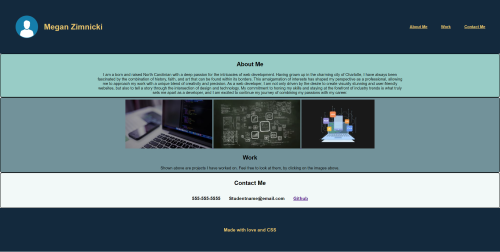

# Portfolio

## Description


The motive of this assignment was to create an example profolio 
for a future employer. We had to display examples of pervious work done for employer to critique future employees skill set.
We also wrote in contact information, so if hired one may reach out to the appropriate user.

```md

```


## Links

[Live URL](https://github.com/meg-an321/project-02-portfolio)

[GitHub Repo](https://meg-an321.github.io/project-02-portfolio)